<!--
  ~ Copyright (c) 2022 Tobias Briones. All rights reserved.
  ~ SPDX-License-Identifier: MIT
  ~
  ~ This source code is part of
  ~ https://github.com/tobiasbriones/cp-unah-is512-osii and is
  ~ licensed under the MIT License found in the LICENSE file in the root
  ~ directory of this source tree or at https://opensource.org/licenses/MIT
  -->

# Apache Server

This documentation requires basic understanding of Linux, Cloud, Website
development, and DevOps. The process of deploying a secure website from scratch
by configuring the Apache web server is developed. User authentication to access
the website is set up. Additional ports are also used to deploy other websites.

## Get Started

For this project, there are the following requirements:

- Domain Name.
- VM.
- Website to Deploy.

I chose to use Porkbun for acquiring the domain name, Digital Ocean for the VM,
and [Coniestica](https://github.com/tobiasbriones/ep-coniestica) (an EP I use to
use for these scenarios).

I opted for this config because I want to make some test to those platforms, I
have expertise on domain names, and Porkbun has super cheap prices. Digital
Ocean is more mature now, and I've seen they have managed databases, so it is a
good chance to check out over there.

### Get the Domain Name

You need a domain name to set up the web server. I'll lead you through this
on [Porkbun](https://porkbun.com). As you can see, there are many cheap
[registration prices](https://porkbun.com/products/domains), you can also go to
other registrars like [Namecheap](https://namecheap.com) (most popular),
[Google Domains](https://domains.google), [Name.com](https://name.com), or many
others. I was able to find domain registration as low as about $1 in Porkbun,
and bought this one:

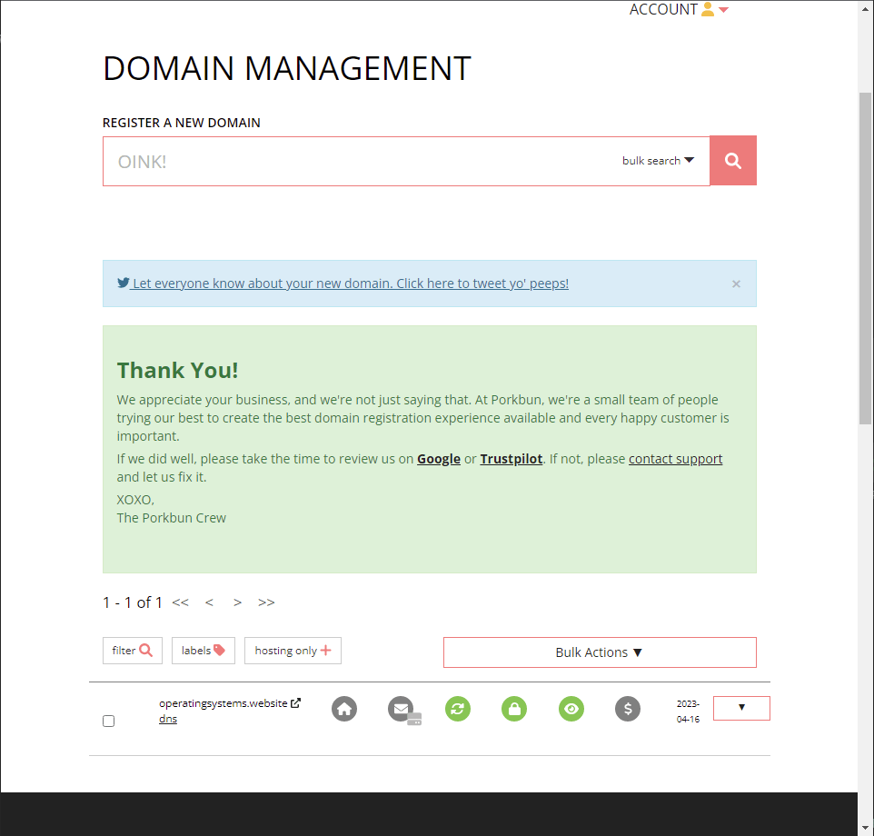

<figcaption>
<p align="center"><strong>Porkbub Buy Domain</strong></p>
</figcaption>

A .website domain for about $1.11. The process is always simple, select your
domain name, and go to checkout to pay with your account. Make sure your account
is secure as it contains your personal information and your domain names, this
is sensitive information, or else imagine someone stealing your domain name,
that would be a nightmare. I leave you
this [scary story](https://www.namepros.com/threads/domains-got-stolen-from-my-namesilo-recovered.1097787)
you can read.

This is IMPORTANT. Always make sure to get (for free or paid) WHOIS Privacy
which is a service to make your contact information private. Otherwise, you will
get hundreds of phone calls from Indian marketers. This should always be
private, but that's how the business works, if you get it for free, they always
charge it on hidden fees or the final price anyway. The course professor didn't
tell students about this (he almost never showed up actually as usual in this
third-world university), and this is something you must be aware of. I forgot to
mention this when I published the first version of this article because I have
so much experience, I take it from granted, but try to be careful with your
steps.

I will also tell you, that your domain name is like your facade, home, or
company. Imagine if you lose them!. That is really terrible. So take the domain
registration as an important process. Always make your research on different
available options, and your needs.

## Get the VM

I'll lead you to Digital Ocean on this endeavour. There are many other options
like Linode, Azure, AWS, or Google Cloud too.

Head to "Droplets" on the "Manage" navigation, and click on "Create Droplet".

I chose an Ubuntu 20.04 (LTS) x64, Basic plan, Regular with SSD $5/mo CPU
(1GB, 1 vCPU, 25GB SSD, 1000GB transfer) configuration.

The datacenter might be "New York (1)" for this test, and the VPC as default.

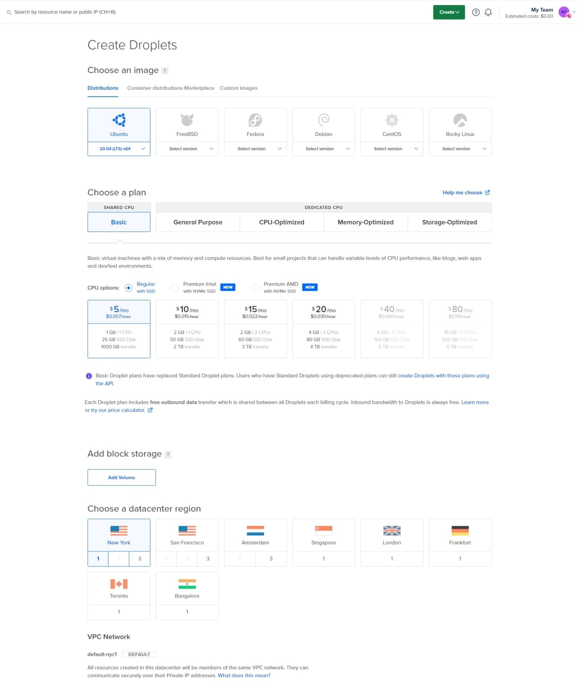

<figcaption>
<p align="center"><strong>DigitalOcean Create Droplet</strong></p>
</figcaption>

For authentication, use SSH which is more secure. Now a key pair is to be
created. Click on "New SSH Key", to create a new key you can
read [How-to Add SSH Keys to New or Existing Droplets \| DigitalOcean Documentation](https://docs.digitalocean.com/products/droplets/how-to/add-ssh-keys)
to add the public key to the public field. SSH keys are automatically generated
in other platforms like AWS or Azure when creating them, that's a downside of
DO.

Then, set a hostname like "ubuntu-do".

Click on "Create Droplet" and wait until the machine is deployed.

You will have created a droplet like this:

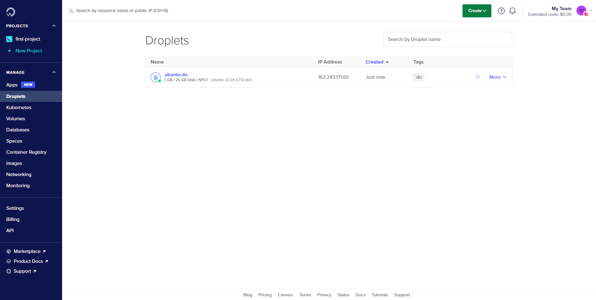

<figcaption>
<p align="center"><strong>DigitalOcean Droplets</strong></p>
</figcaption>

## Get the VM Started

First, log into your VM. You can use PuTTY following
[this guide](https://docs.digitalocean.com/products/droplets/how-to/connect-with-ssh/putty)
to enter your server as root user.

Once you are into your machine, execute basic maintenance commands:

`sudo apt update`

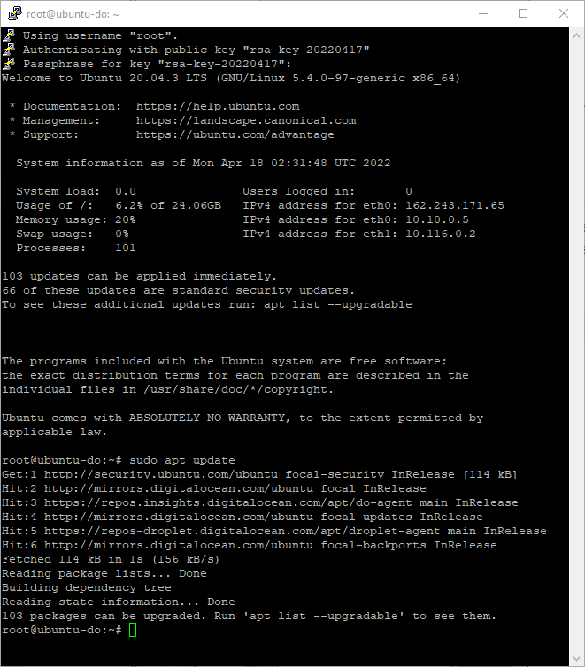

<figcaption>
<p align="center"><strong>PuTTY Log into VM</strong></p>
</figcaption>

It is highly recommended creating a different user to avoid using the root user
as [detailed here](https://www.digitalocean.com/community/tutorials/initial-server-setup-with-ubuntu-16-04)
.

Run `adduser { username }` and set the user's password and other information.
Then add root privileges to that user as follows:

`usermod -aG sudo { username }`

That will add your new user to the sudo group. In this case, my username is
"tobi".

Then generate another key pair for giving SSH access to the new user.

Add the public key next, first enter as root to then change to the new user:

`su - { username }`

`mkdir ~/.ssh`

`chmod 700 ~/.ssh`

`cd ~/.ssh`

`nano authorized_keys`

And paste your public key.

`chmod 600 ~/.ssh/authorized_keys`

`exit`

Now disable password authentication:

`sudo nano /etc/ssh/sshd_config`

Find this property, and make sure it is uncommented and set to "no", that
is, `PasswordAuthentication no`. For my case, this was already configured that
way.

Other attributes that we have by default are `PubkeyAuthentication yes` and
`ChallengeResponseAuthentication no`.

Finally, reload the SSH daemon with `sudo systemctl reload sshd`.

Now you can log with the new user created.

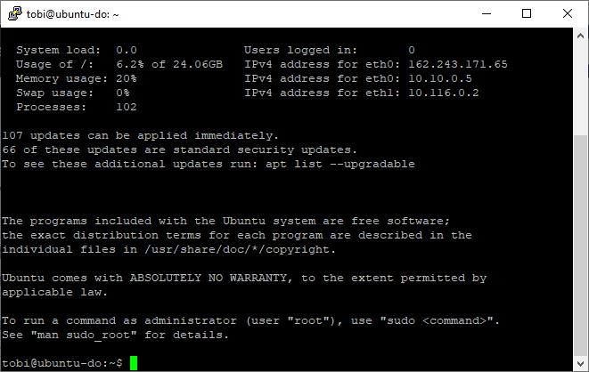

<figcaption>
<p align="center"><strong>PuTTY Log as tobi</strong></p>
</figcaption>

### Set Up the Firewall

Make sure the firewall will allow you to connect via SSH, this is a common
problem when playing with this.

`sudo ufw app list`

It'll show `OpenSSH` as available applications.

And make sure to allow your connection:

`sudo ufw allow OpenSSH`

Now run:

`sudo ufw enable`

`sudo ufw status`

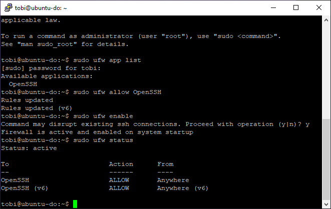

<figcaption>
<p align="center"><strong>PuTTY Firewall Config</strong></p>
</figcaption>

## Install Apache

Start with these commands:

`sudo apt-get update`

`sudo apt-get install apache2`

Create the public directory for the website:

`sudo mkdir -p /var/www/operatingsystems.website/public`

Where "operatingsystems.website" is the name of our website to deploy.

Change ownership for the normal user (you have to be logged as the new user you
created):

`sudo chown -R $USER:$USER /var/www/operatingsystems.website/public`

`sudo chmod -R 755 /var/www`

## Clone the Website

We're going to use my example project website as said above. Clone the
repository first:

`git clone https://github.com/tobiasbriones/ep-coniestica.git`

And install node with NVM, get the latest script version
from https://github.com/nvm-sh/nvm#installing-and-updating

`curl -o- https://raw.githubusercontent.com/nvm-sh/nvm/v0.39.1/install.sh | bash`

`source ~/.bashrc`

Check the Node versions with `nvm list-remote` and install the latest (LTS or
normal) version:

`nvm install v16.14.2`

`nvm list`

Now go into the project directory `cd ep-coniestica` to build the project:

`npm i`

`npm run build:prod`

Then you'll have a "dist" directory that contains the production-ready website.
That is what has to be copied to the public directory to be deployed.

`mv -v dist/* /var/www/operatingsystems.website/public`

## Create the Virtual Host File

Virtual Hosts are individual entities in the Apache web server, this way you can
have several websites on the same machine for example. The default is the
file `000-default.conf` that we'll use as a basis for adding the others.

`sudo cp /etc/apache2/sites-available/000-default.conf /etc/apache2/sites-available/operatingsystems.website.conf`

`cd /etc/apache2/sites-available/`

`sudo nano operatingsystems.website.conf`

Recall that, the default port is port 80. So first, we need to configure the
domain for this website.

Set the `ServerAdmin` directive to an admin email you can use.

Set the `DocumentRoot` directive to `var/www/operatingsystems.website/public`.

Add two more directives, `ServerName operatingsystems.website` and
`ServerAlias www.operatingsystems.website`.

It'll look like this:

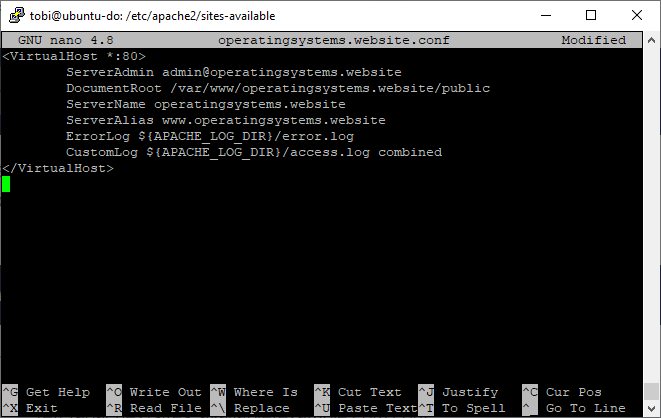

<figcaption>
<p align="center"><strong>PuTTY Main Virtual Host</strong></p>
</figcaption>

Now enable the virtual host file:

`sudo a2ensite operatingsystems.website.conf`

Disable the default with `sudo a2dissite 000-default.conf`, and reload the
server `sudo systemctl restart apache2`.

This exercise is to be repeated for creating more virtual host files.

Now by enabling the port 80 via `sudo ufw allow 80` you will be able to open the
page at http://operatingsystems.website (your own domain).

## Set Up the Domain Name

Go to Porkbun to your domain DNS Record config. Add the following config with
your VM's IP address.

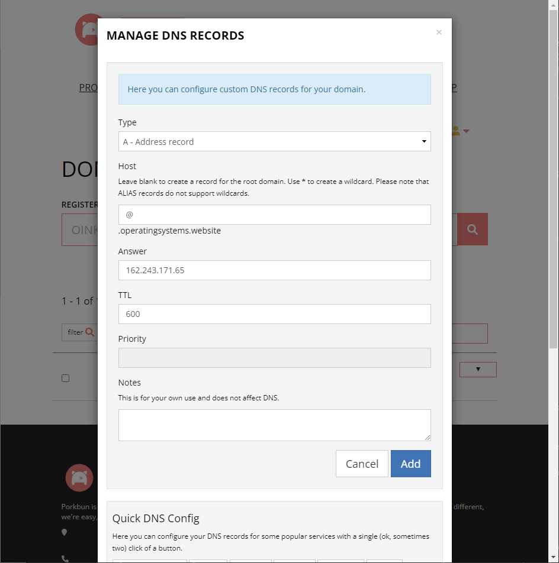

<figcaption>
<p align="center"><strong>Porkbun Set Up DNS Records</strong></p>
</figcaption>

Add another for "www" too.

That's it. The domain name will respond with the website.

There's another way to add domains to DO, by going to your VM and clicking on
the "More" menu, then "Add a domain". We used the apache virtual host to set up
out web server this time.

## Install Let's Encrypt SSL Certificate

We need to install certbot and python3-certbot-apache
first `sudo apt install certbot python3-certbot-apache`. Now we already have the
virtual host configured with the `ServerName` and `ServerAlias` directives.

Check the state of the virtual host file with `sudo apache2ctl configtest`, and
reload the server `sudo systemctl reload apache2`.

### Allow HTTPS

Run `sudo ufw status` to check your current config, then
`sudo ufw allow 'Apache Full'`, and `sudo ufw delete allow 80` or
`sudo ufw delete allow 'Apache'` depending on your current config.

### Obtain the SSL Certificate

Use `sudo certbot --apache`, and enter a valid email address, then accept the
information that will be asked to you.

Great! Reload the page and you will have HTTPS enabled.

## Add Users with Password

We'll need three users to access the website with a password.

Install `apache2-utils` if not installed yet, so we can store our credentials:

`sudo apt-get update`

`sudo apt-get install apache2-utils`

Store an "admin" user with password "sistemasoperativos" by creating the next
file. Use the "-c" argument the firsts time to create the file.

`sudo htpasswd -c /etc/apache2/.htpasswd admin`

Then enter the user password.

And add two more users as desired:

`sudo htpasswd /etc/apache2/.htpasswd { other-user }`

Just to mention, I added the example users "tobi:tobiasbriones", and
"do:digitalocean" (username:password).

Check the ".htpasswd" file with `cat /etc/apache2/.htpasswd` that will show the
encrypted passwords for each user. My users look like this:

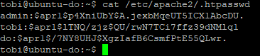

<figcaption>
<p align="center"><strong>Website Users</strong></p>
</figcaption>

Go to the host file to add the following child:

`sudo nano /etc/apache2/sites-enabled/operatingsystems.website.conf`

If you are using SSL (you should) then edit the
`operatingsystems.website-le-ssl.conf` file instead.

```
<Directory "/var/www/operatingsystems.website/public">
    AuthType Basic
    AuthName "Proyecto de Sistemas Operativos II"
    AuthUserFile /etc/apache2/.htpasswd
    Require valid-user
</Directory>
```

It'll look like this:

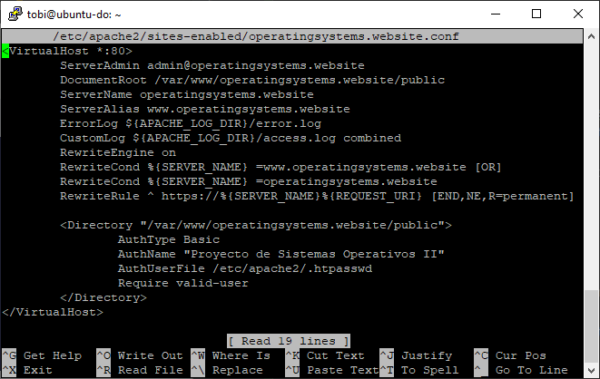

<figcaption>
<p align="center"><strong>PuTTY Auth VirtualHost Config</strong></p>
</figcaption>

Restart `sudo service apache2 restart`.

Then, the client will ask you for user and password:

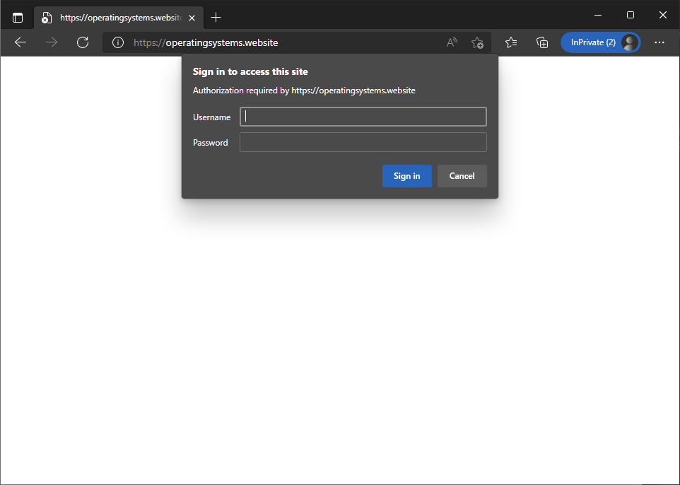

<figcaption>
<p align="center"><strong>MS Edge Prompt enter Credentials</strong></p>
</figcaption>

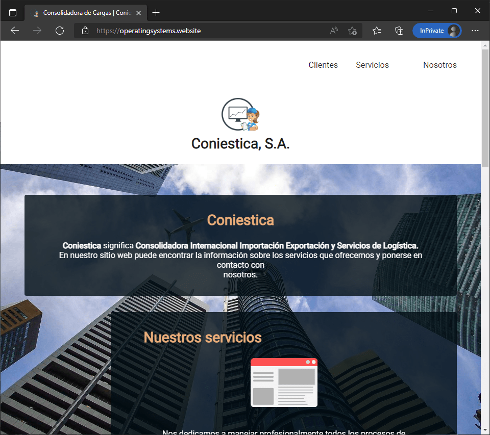

<figcaption>
<p align="center"><strong>MS Edge Coniestica</strong></p>
</figcaption>

## Add more Sites on Different Ports

This will deploy more websites to different ports. They'll be 4 websites on
ports 8081-8084.

The procedure will be done for one website, and then this has to be copied for
the others.

Make a new directory for the new site
with `sudo mkdir /var/www/operatingsystems.website.8081`.

Create its public directory with
`sudo mkdir /var/www/operatingsystems.website.8081/public`.

Then create an "index.html" file into the "public" directory to add some
content. Now copy the normal (80 HTTP) virtual host with
`sudo cp /etc/apache2/sites-available/operatingsystems.website.conf /etc/apache2/sites-available/operatingsystems.website.8081.conf`
.

Open the file and make the respective changes:

`sudo nano /etc/apache2/sites-available/operatingsystems.website.8081.conf`

Changing the port from 80 to 8081, the `DocumentRoot` directive, and the
`Directory` child config would be enough. We'll leave the same password file for
authentication, create other password file with other users if needed.

Enable the new site with

`cd /etc/apache2/sites-available/`

`sudo a2ensite operatingsystems.website.8081.conf`

The VirtualHost will look like the following. If you copied the original virtual
host, you might need to remove some directives as they will redirect you to the
main (443) port.

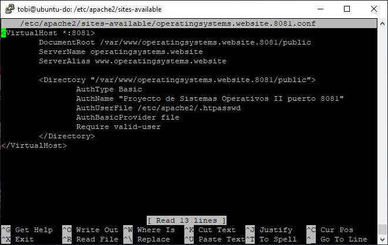

<figcaption>
<p align="center"><strong>PuTTY VirtualHost 8081</strong></p>
</figcaption>

Add the port 8081 to the Apache config `sudo nano /etc/apache2/ports.conf`
by adding "Listen 8081" to that file.

The ports.conf file will look like this:

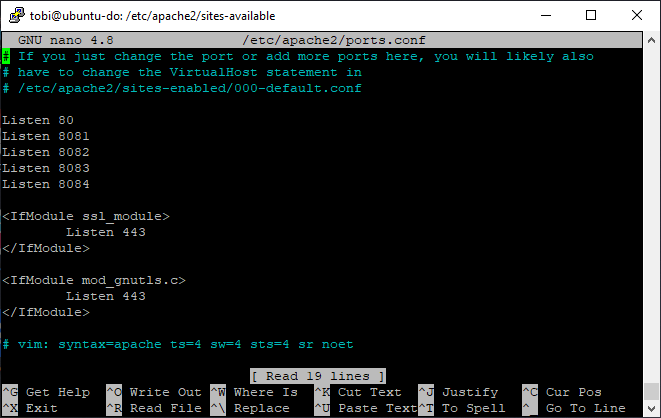

<figcaption>
<p align="center"><strong>PuTTY Ports Config</strong></p>
</figcaption>

Restart `systemctl reload apache2`.

Now to make the outside world access that port on our machine we need to allow
it on the firewall rules:

`sudo ufw allow 8081`

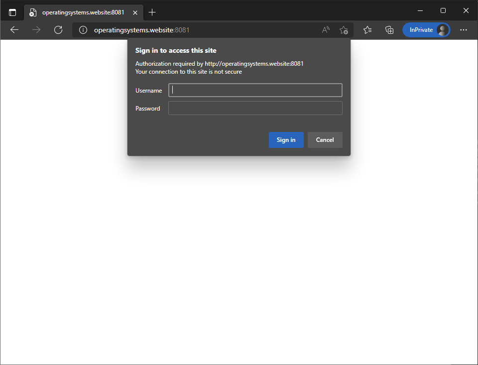

<figcaption>
<p align="center"><strong>MS Edge Port 8081</strong></p>
</figcaption>

To add the other sites, replicate this section again.

Make sure to access as HTTP because the HTTPS connection is only for the secure
port 443.

### Result

This is the result that has been achieved, visiting each port, from the main
Coniestica page port 443, until ports 8081-8084:


<figcaption>
<p align="center"><strong>Apache Server Results</strong></p>
</figcaption>

The templates for the other websites deployed on ports 8081-8084 were taken from
this site [themewagon.com](https://themewagon.com). You can do this extra step
to add more sites to your project.

Recall that you will need authentication for all the ports, but the browser also
caches your credentials.

## Conclusion

Many Linux system admin concepts like firewall, DNS, web servers, virtual hosts,
system users, secure connections via SSH and SSL, open-source, authentication,
cloud computing, and virtual machines where applied to the Apache2 server that
deployed the Coniestica website securely on the internet, and also allowed other
ports to be open for users hosting other websites.

## Recommendations

- If you get into some error or trouble by configuring a system, your work as an
  engineer is to solve problems, not to give them. Figure it out how to solve
  it. Real engineers write the docs, so to be a good one, you must be capable of
  reading and writing technical documentation. That also implies asking someone
  else if that'll lead to solve the problem properly.

- Collaborate to open-source whenever you see anything helpful. This project was
  possible thanks to my own open-source projects including this article, and the
  Coniestica website (that is also mine), as well as Ubuntu, and the Apache
  server that are also open-source. Respect copyrights and licenses too, that is
  crucial to be successful.

- Systems engineering is about keeping up to date all the time. Make informed
  decisions. I used DigitalOceana and Porkbun this time, but I could've used
  anything else too. Why chose something over many other options?

- Be careful with passwords, SSH keys. Try to be as secure as possible.

- Please use a PaaS because they are meant to make a developer life easy. Learn
  how to do this by hand, but if you're not either a systems admin, or DevOps
  then don't lose time maintaining an IaaS. Only that, requires the role of a
  dedicated engineer.

- The problem with some engineers (with university degrees, a great amount) who
  have lack of theoretical education is that they are bunglers or incompetent,
  so they create unprofessional or unmaintainable projects. Move away from  
  this by learning "useless things" like math, UML, etc. That will give you
  insight on your experience on why things are wrong and why are right. Hence,
  those who studied Math are more capable of solving more important problems
  than plain engineers. Engineering means employing rigorous processes to solve
  real world problems according to real constraints, not having fun like some
  developers usually say. You can make it fun by writing articles like this!.
  The reward of creating original content is great in the long run for good
  engineers.

- Don't install unnecessary software. Example, at university professors had
  always asked me to open my local machine ports so "the other can ping to me".
  You shouldn't do this as your personal machine gets exposed to the internet
  and someone might brute force (mitigated by your router though)
  your login and hack into your system. If it is not necessary, and does not
  make sense to do something, then don't allow it. Use the cloud because that's
  how you'll do in real life. Universities are scam, they just live in a fake
  world while someone with no knowledge gets paid to bother students, I've had
  to do the job of the professors by tutoring students since I started the
  university. I feel good for those who appreciated it, but most of them just
  wanted to pass the class. I basically write everything I do, but if some
  intelligent student finds my projects they will be able to use it properly, on
  the other hand, if some ordinary student wanting to just approve finds the "
  homework done" they will not know how to proceed since I add "steroids" to all
  of my projects. That's why I like doing these works that are aimed to help
  those who deserve them.

- Don't use Windows (or even Mac) for production please. Just companies with
  lack of IT talent, and archaic bureaucracy use M$ Office or Windows!. Ubuntu
  Server is one of the greatest OSs for the cloud. You will find many more
  distribution if you dedicate your career to DevOps or Systems
  Engineering/Admin. If you get paid to work on Windows Server, you are not in
  the right job. Do it if you like it, but it is nonsense to learn Windows when
  now, Windows has become a Frankenstein trying to mimic Linux, Mac, and
  Android. M$ used to have a toxic culture when ~~engineers~~
  marketers put everything the other way around just to make it "Microsoft
  Windows" branded, I mean, this "\\" instead of normal slash "/", Hungarian
  notation, "Folders" instead of "Directories", etc. Why use a Windows trying to
  be more open, and look like Linux, and Mac when you can just use the very
  genuine Linux and Mac (and Java)? These platforms have been developed under
  genuine design decisions since, or almost since inception. Windows relies on
  the mouse, and it is meant for companies paying licenses to forget about
  technical details which has led to general-purpose solutions on business that
  are not accurate, now you have to learn Excel and stuff (third-party mediocre
  software) instead of software engineering. Students must learn engineering to
  apply proper solutions, and leave general-purpose software for weak companies.
  It is right to study proper engineering rather than garbage like MS Excel for
  example, but Excel is a must for getting many jobs. The last thing you want as
  a competent engineer is working at a crap company where you have "a boss", and
  they don't speak your (technical) language, like banks, government, most
  universities, etc. Companies should just employ domain-specific software to
  have their own business professionals talking to that software instead. It's
  about addressing the domain problem not the domain solution. They shouldn't
  need engineers at all. What I mean, is that, your objective as an engineer is
  to work at a tech company, or build your own (there are infinitely many
  problems to solve), just lame engineers work at traditional bureaucratic
  companies. Ok, sometimes we need to get employed, but you can't end up working
  in a bank, or non-tech organization forever!.

- One professor once said, use Windows because the GUI is easier than Linux, and
  companies in third-world pay it better. That's why alumni from public
  universities end up working at "weak" archaic companies, they are not actual
  engineers, so they end up working with MS Office, most of them don't even know
  what Markdown or GitHub is. I hate it because they steal others credits being
  product managers, the one who socializes the projects but never work, the
  so-called "best engineer of the university" just because he puts 100% grades
  on every student (easy job), or put nonsense titles like "
  scientist" or "engineers" when they don't have the bare minimum studies
  (degrees don't matter here). That's why I don't like LinkedIn a lot, because
  it is full of bureaucrats, and bullshit sellers. I love engaging with
  technical people like me, but it is a really hard time to meet more of them as
  we are back office, and significantly different from the average. I always
  introduce myself to people giving the minimum information about me (I don't
  need to say facts like I have the best grades, I'm better than you all, etc.),
  I just let flow everything naturally, and that taught me that most people are
  fake, and worthless. For example, I have faced various situations when I enter
  a team, they know each other, but I am only a fool-quiet guy for them at the
  beginning (universities are for showing off appearances), and then I start
  demonstrating my work by being professional, and saving their asses because I
  am the only one who understood what to do, they didn't even know me, so they
  end up with a good reputation of me immediately after the "welcome". In one
  team, there was an asshole (he used to be so), and I had some diagrams from
  older personal projects, I shared the diagrams with them, but he told that
  they were taken from the internet, and were not mine, and "we need to make
  something mediocre, so the professor thinks it is our work", he was so mean to
  me (this time, I did not reply his comments, no need to so) that he even
  deleted all the messages some minutes later (cringe). I was so better than
  them all, that I always had an explanation (although harder to speak, because
  I write, but don't like to speak), that my personal works looked like taken
  from a book, but I never show off my superiority, I always let my genuine work
  talk for me when required instead (humble, from inside to outside, but that
  doesn't mean I'm a fool with no understanding on what extroverts do). I
  actually took the diagrams from the internet, but from my own project!. It is
  stupid to go to the university, you are cleverer than them (professors, and
  students), and then you have to mimic you're a fool just to give the professor
  a "proof" that you actually made the homework. In other words, the education
  system is meant for fools, if you are better than that, they will not like you
  at all. I was really mad at that moment, but now I have more experience to
  manage all kind of scenarios. Those experiences + high technical knowledge
  turn you into a "Senior Engineer", so now you know it!. I don't care if you
  even don't know anything as far as you are able to be genuine on your
  studies/professional objectives.

- It's easy to read manuals, but if you go all the way up writing your own
  content, then congrats!. Recall that quality also plays a crucial role here.
  Anyone can write garbage documentation using wrong tools like Excel or Word
  because they are not engineers disregarding how many degrees they have, or if
  they call themselves "scientists" or whatever. A real engineer knows how to
  solve problems properly when they appear, there is no static formula given by
  any university degree that will tell you how to do it. It is something dynamic
  to use your ability to address any problems. Initiative is a must for any
  talented engineer always!.

## Resources

### Video Presentation

<iframe width="560" height="315" src="https://www.youtube-nocookie.com/embed/0_JUkrxzy-Q" title="YouTube video player" frameborder="0" allow="accelerometer; autoplay; clipboard-write; encrypted-media; gyroscope; picture-in-picture" allowfullscreen></iframe>

## Bibliography

- [EP: Coniestica \| GitHub Repository](https://github.com/tobiasbriones/ep-coniestica)
- [Initial Server Setup with Ubuntu 16.04 \| DigitalOcean](https://www.digitalocean.com/community/tutorials/initial-server-setup-with-ubuntu-16-04)
- [How to Connect to your Droplet with PuTTY on Windows \| DigitalOcean Docs](https://docs.digitalocean.com/products/droplets/how-to/connect-with-ssh/putty)
- [How-to Add SSH Keys to New or Existing Droplets \| DigitalOcean Docs](https://docs.digitalocean.com/products/droplets/how-to/add-ssh-keys)
- [How To Install Node.js on Ubuntu 20.04 \| DigitalOcean](https://www.digitalocean.com/community/tutorials/how-to-install-node-js-on-ubuntu-20-04)
- [NVM \| GitHub Repository](https://github.com/nvm-sh/nvm#installing-and-updating)
- [How To Secure Apache with Let's Encrypt on Ubuntu 20.04 \| DigitalOcean](https://www.digitalocean.com/community/tutorials/how-to-secure-apache-with-let-s-encrypt-on-ubuntu-20-04)
- [How To Set Up Password Authentication with Apache on Ubuntu 18.04 \| DigitalOcean](https://www.digitalocean.com/community/tutorials/how-to-set-up-password-authentication-with-apache-on-ubuntu-18-04)
- [Binding to Addresses and Ports \| Apache HTTPD](https://httpd.apache.org/docs/2.4/bind.html)
- [Apache Module mod_auth_basic \| Apache HTTPD](https://httpd.apache.org/docs/current/mod/mod_auth_basic.html#authbasicprovider)
- [Domains got stolen from my namesilo [Recovered] \| NamePros](https://www.namepros.com/threads/domains-got-stolen-from-my-namesilo-recovered.1097787)
