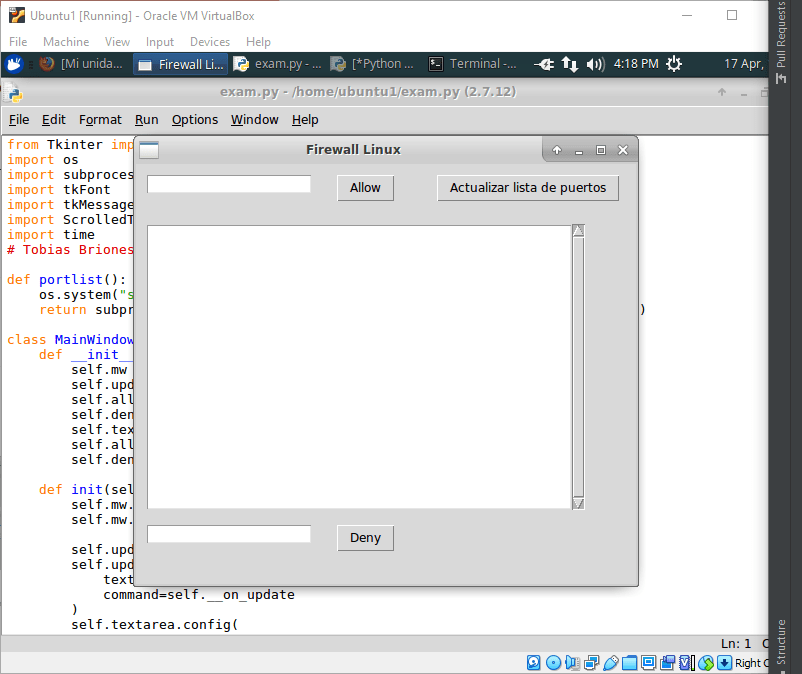

# Exam

## Introduction

You need to test your virtual machines created in VirtualBox to perform some
system administration.

The virtual machines are two Ubuntu Server images like the picture below:

You should run maintenance commands like:

`sudo apt update`

Then install a remote desktop to control the server via GUI, setting up commands
like these:

`sudo apt install xrdp`

`sudo apt install xubuntu-desktop`

`sudo systemctl status xrdp`

Or any other GUI you like.

`sudo ufw allow 3389`

To allow the remote connection port.

Make sure to connect the VM to the internet via Bridge Adapter so your Windows
machine can access their IP addresses.

Then you should be able to do something like this:

To enter your username and password to log into the machine.

Other tasks involved are firewall configurations using the `ufw` command.

This introduction gave an insight about the administration given to the VMs.

## Program

The program consists of a TK Window on Python to run system commands to set up
the firewall. The commands used are the following:

Get the firewall status and save it into the portlist.txt file.

`sudo ufw status > portlist.txt`

Then we can read that file with `cat /home/ubuntu1/portlist.txt`.

The other commands used are to allow and deny the ports on our system:

`sudo ufw allow { port }`

`sudo ufw deny { port }`

By creating the GUI in the `MainWindow` class (Java like GUI) we'll have the
following results:

The code can be edited with IDLE by opening the IDE via `sudo idle exam.py`.
Then the app can be executed with `F5`.

**Run App**

**Update Ports**

This way, we can also enter a port into the top field to allow it, or into 
the bottom field to deny it.

This information can be checked via terminal running the same command `sudo 
ufw status`.
